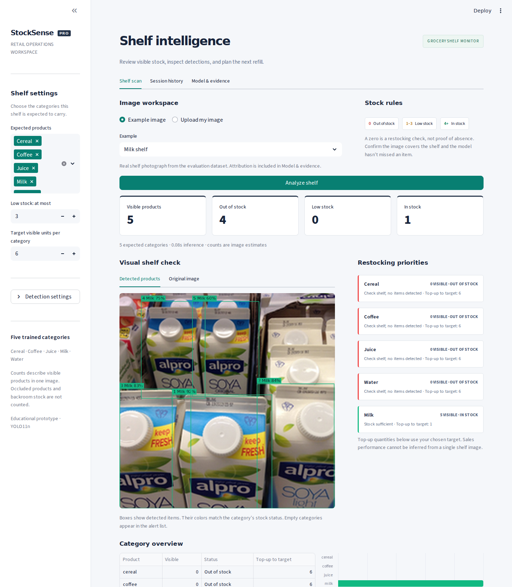
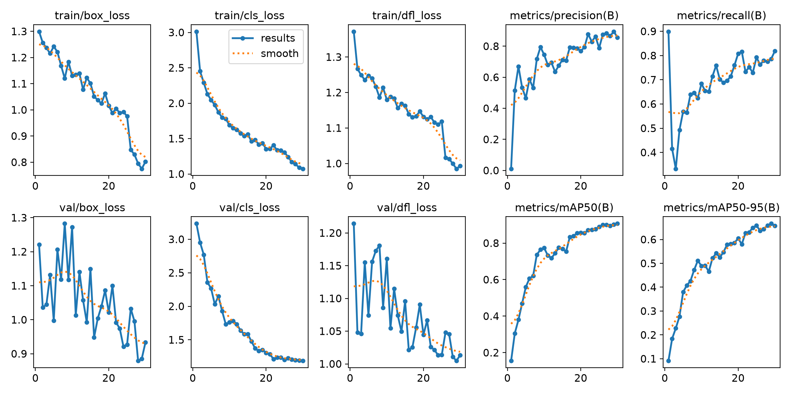
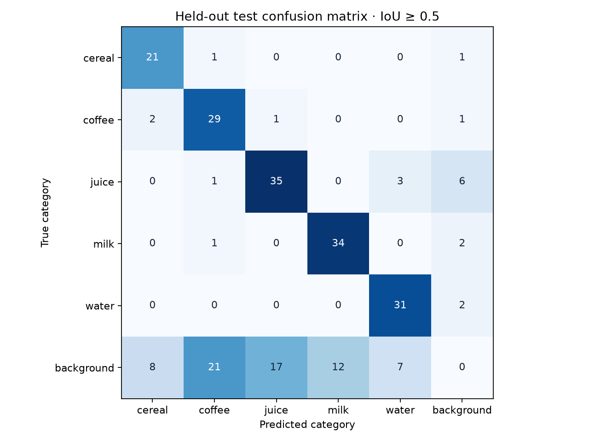

# StockSense Pro

**A retail shelf dashboard that detects products, counts visible items, and prioritizes restocking.**

CRS Artificial Intelligence · Machine Learning and Deep Learning · Scenario 2

**Student:** [ADD FULL NAME]  
**Candidate registration number:** [ADD NUMBER]  
**School:** [ADD SCHOOL]  
**GitHub repository:** [ADD REPOSITORY URL]  
**Live Streamlit app:** [ADD LIVE URL AFTER DEPLOYING]



## Ready to run

The trained model, sample images, dependency list, and complete source code are included. No API key is needed. The deployed app uses CPU-only ONNX inference and makes no model downloads. Training is already completed; it is not required to launch the app.

1. Extract the project ZIP on your computer.
2. Upload the **contents** of `stocksense-pro/` to the root of a GitHub repository, preserving the folders. Do not upload only the outer ZIP.
3. In [Streamlit Community Cloud](https://share.streamlit.io/), create an app from that repository. Choose the branch you uploaded, set the main file to **`app.py`**, and select **Python 3.12** in Advanced settings.
4. Deploy. Copy the resulting app URL into this README and `docs/submission_details.json`.

Repository name suggested by the brief: `IADAI201<student_id>-<studentname>`.

See [START_HERE.md](START_HERE.md) for the beginner-friendly upload guide. Every individual packaged file is below 25 MiB. Dataset images are bundled into five archives to keep browser uploads manageable; keep these archives zipped when uploading.

## What the app includes

- Real YOLO11n product detection for **cereal, coffee, juice, milk, and water**.
- JPEG, PNG and WebP upload, plus real dataset examples.
- Bounding boxes and confidence scores, original/annotated image comparison.
- Expected-category selection, including alerts for categories with zero detections.
- Adjustable low-stock thresholds and visible-stock targets.
- A priority list, stock table, category chart, and four summary metrics.
- Confidence and duplicate-overlap controls, with optional overlapping-section scanning for wide shelves.
- Downloadable annotated PNG, stock CSV, scan JSON and session CSV.
- A model-evidence tab with measured results and stress tests.

## Problem and scope

Manual shelf inspections are slow and can miss low-stock products. This prototype takes a shelf photograph and returns the location, broad category and visible count of supported products. Threshold-based alerts help a staff member decide which categories to check and replenish.

This is category-level detection, not brand/SKU identification. Counts cover visible products in one photo, not hidden units, other shelves, backroom inventory, or sales. A single photograph cannot establish which products are selling fastest. The app deliberately does not invent sales rates.

## Research that informed the implementation

1. **Jund, Abdo, Eitel and Burgard (2016), [The Freiburg Groceries Dataset](https://arxiv.org/abs/1611.05799).** Real grocery photographs include different lighting, viewpoints and clutter. This informed the use of real images and lighting/flip stress checks. The original research is a classification benchmark; our detection boxes come from the extension below. Its published classification accuracy is not this project's result.
2. **[5K Groceries Dataset for Object Detection](https://github.com/aleksandar-aleksandrov/groceries-object-detection-dataset).** Adds Pascal VOC product boxes to Freiburg images. It supplies the annotated photographs used here. Original credits are retained in `DATASET_CARD.md`.
3. **Redmon et al. (2016), [You Only Look Once: Unified, Real-Time Object Detection](https://arxiv.org/abs/1506.02640).** Supports single-stage detection as a practical way to produce categories and locations together. This project uses the later Ultralytics YOLO11n implementation, not the original paper's network.
4. **[Ultralytics YOLO11](https://docs.ultralytics.com/models/yolo11/) and [training documentation](https://docs.ultralytics.com/modes/train/).** Informed transfer learning, image augmentation, validation-based model selection, and export.
5. **[RPC](https://rpc-dataset.github.io/) and [SKU-110K](https://docs.ultralytics.com/datasets/detect/sku-110k/).** Considered as alternatives. RPC has fine-grained checkout categories; SKU-110K's generic object class alone does not satisfy category-specific stock counts. Neither dataset was used for this run. The brief permits a real-world dataset "like" RPC; Freiburg's annotation extension was selected for a manageable five-category experiment.

## Data preparation

The complete selected dataset is included in `dataset/archives/`. Run `python scripts/unpack_dataset.py` to expand it. The training and evaluation scripts also do this automatically.

| Category | Train | Validation | Test | Total |
|---|---:|---:|---:|---:|
| Cereal | 70 | 15 | 15 | 100 |
| Coffee | 70 | 15 | 15 | 100 |
| Juice | 70 | 15 | 15 | 100 |
| Milk | 70 | 15 | 15 | 100 |
| Water | 70 | 15 | 15 | 100 |
| **Total** | **350** | **75** | **75** | **500** |

- Source extension images are 224 × 224 RGB. The bundled model uses the brief's basic 224 × 224 option; 640 is a retraining option for larger source images, not a claim that these images contain 640-pixel detail.
- `prepare_data.py` validates/clamps boxes, removes exact pixel duplicates, samples categories reproducibly with seed 42, and creates the 70/15/15 split **before** augmentation.
- Pascal VOC boxes become YOLO lines: `class_id center_x center_y width height`, with box values normalized to 0–1. Class IDs follow `dataset/data.yaml`.
- Model inputs are scaled from 0–255 to 0–1. Aspect ratios are preserved through padding during uploaded-image inference.
- Training uses ±10° rotation, horizontal flips, brightness/saturation changes, scale/translation and mosaic. Validation/test images are not randomly augmented.
- `dataset/manifest.csv` records every image, split, box count and original decoded-pixel SHA-256. Exact duplicates do not cross splits. Similar products/scenes may still occur in different splits because reliable store/sequence group IDs were unavailable.

## Model development

| Setting | Completed run |
|---|---|
| Detector | Ultralytics YOLO11n, five output categories |
| Initialization | COCO-pretrained `yolo11n.pt` |
| Fine-tuning | 30 epochs, batch 16, CPU |
| Input | 224 × 224 |
| Optimizer | AdamW, initial learning rate 0.001 |
| Frozen layers | First 10 layers |
| Seed | 42 |
| Selection | Best validation fitness; test set not used to select weights |
| Deployment | Static ONNX, opset 17, CPUExecutionProvider |

The trained weights are `models/best.pt`; the deployed model is `models/best.onnx`. Source code for training/export is in `scripts/train.py`. Actual training curves, arguments and epoch metrics are in `reports/`.



## Measured performance

The following are **measured results from this completed run**, not illustrative numbers. All 75 held-out test images were evaluated.

| App's ONNX pipeline at confidence 0.25 | Result |
|---|---:|
| Micro precision, matched at IoU ≥ 0.50 | 68.75% |
| Micro recall, matched at IoU ≥ 0.50 | 90.06% |
| F1 | 77.97% |
| Mean absolute count error per category per image | 0.2053 items |
| Images with all five category counts exactly correct | 48.00% |
| Images / annotated objects | 75 / 171 |

The count MAE above averages over five categories, including absent categories. The equivalent sum of category errors averages **1.0267 items per image**. Precision counts only correctly classified boxes with sufficient overlap; counting correctness is a separate metric. Generic classification accuracy is not an appropriate substitute for these detection/counting metrics.

Separately, Ultralytics' standard test evaluator measured **mAP@0.50 = 86.58%** and **mAP@0.50:0.95 = 64.96%**. Its reported precision/recall use its own confidence operating point and preprocessing; do not interchange them with the fixed-threshold app results. Full values are in `reports/ultralytics_test_metrics.json`.

| Stress check | Images | Precision | Recall | Exact count rate |
|---|---:|---:|---:|---:|
| Original | 75 | 68.75% | 90.06% | 48.00% |
| Brightness reduced to 45% | 75 | 65.18% | 85.38% | 40.00% |
| Horizontal flip, boxes transformed | 75 | 68.89% | 90.64% | 45.33% |
| Images with at least 3 annotated objects | 22 | 78.35% | 86.36% | 36.36% |

These derived variants reuse the same test images; they are not independent new datasets. Optional section scanning is not covered by these benchmark results.



`reports/counting_results.csv` gives per-image expected/predicted counts. `reports/test_predictions.zip` contains the predicted boxes. Inspect failures as well as successful examples.

## Stock logic and decisions

| Count | Default status | Action |
|---|---|---|
| 0 | Out of stock | Check the shelf and confirm the model has not missed the product |
| 1–3 | Low stock | Restock needed |
| 4 or more | In stock | Stock sufficient |

The assignment prints overlapping ranges for count 3. This project consistently uses **1–3 low, 4+ in stock**. Expected categories must be selected explicitly so unstocked categories are not automatically treated as missing. Top-up suggestions are `max(0, target - visible count)`, not purchase orders. Priorities put zero-count categories first, followed by low-count categories.

## Verification and limitations

Automated checks cover threshold boundaries, absent categories, malformed images, RGB conversion, normalization, duplicate suppression, tile-coordinate mapping, the real exported model, data balance/leakage and Streamlit interaction. Run `python -m pytest tests -q` after installing the training requirements.

The model can miss small/occluded products, confuse visually similar packaging and produce false positives. Some source annotations do not exhaustively label background products in dense scenes; reported metrics compare against the supplied annotation set, not a fully audited inventory count. A manually relabeled dense-shelf test set is needed before any operational use. Broad category training does not reliably reject every unknown product.

The default example is a real milk-shelf test photograph. The mixed-product example is explicitly labeled as a photo collage and excluded from benchmark metrics. No fake detection boxes or fixed sample counts are used in the app.

Human usability feedback and the deployed public URL remain to be collected after deployment. The feedback form is in `docs/FEEDBACK_FORM.md`; no feedback has been fabricated. Improvement priorities are complete dense-shelf annotation, more unique stores/brands, additional negative examples, higher-resolution images and group-separated evaluation.

## Run locally or reproduce training

Use Python 3.12.

```bash
python -m venv .venv
# Windows: .venv\Scripts\activate
# macOS/Linux: source .venv/bin/activate
python -m pip install -r requirements.txt
streamlit run app.py
```

For training/evaluation, also install the training requirements. Use a GPU for larger images or datasets. On a CPU-only Linux machine, install CPU PyTorch first to avoid unnecessary CUDA packages:

```bash
python -m pip install torch==2.8.0 torchvision==0.23.0 --index-url https://download.pytorch.org/whl/cpu
python -m pip install -r requirements-training.txt
python scripts/unpack_dataset.py
python scripts/train.py --epochs 30 --imgsz 224 --batch 16 --device cpu
python scripts/evaluate.py
python -m pytest tests -q
```

Training downloads the original pretrained initialization if it is not already present. Exported model inference requires no downloads. Use `notebooks/StockSense_Training.ipynb` for a guided notebook workflow. Training writes new weights, so make a copy of the delivered project before experimenting. Changing model size/classes requires corresponding metadata; the supplied exporter writes both.

## Project files

| Path | Purpose |
|---|---|
| `app.py` | Streamlit entry point |
| `stocksense/` | ONNX inference, image validation, stock logic |
| `models/` | Trained PyTorch and ONNX weights, model metadata |
| `dataset/archives/` | All 500 images, YOLO labels and original annotations |
| `scripts/` | Preparation, unpacking, training, evaluation, submission generation |
| `notebooks/` | Guided training notebook |
| `reports/` | Actual metrics, curves, predictions and test evidence |
| `samples/` | Example images, provenance and explicit collage labeling |
| `docs/` | Screenshot, deployment notes, feedback and submission template |
| `tests/` | Functional and data checks |

## Submission and attribution

Complete `docs/submission_details.json`, then follow `docs/SUBMISSION_CHECKLIST.md`. The included PDF is a **draft template** because student details and live URLs have not been provided. The project was developed with Codex assistance; review the implementation and explain that assistance according to your school's rules. Do not claim personally collected photographs, human feedback, or a live deployment that has not happened.

Project code is provided under AGPL-3.0; see `LICENSE`. Ultralytics code/model lineage and dataset attribution are in `THIRD_PARTY_NOTICES.md` and `DATASET_CARD.md`. Third-party images retain their authors' rights and are not relicensed by this project.
